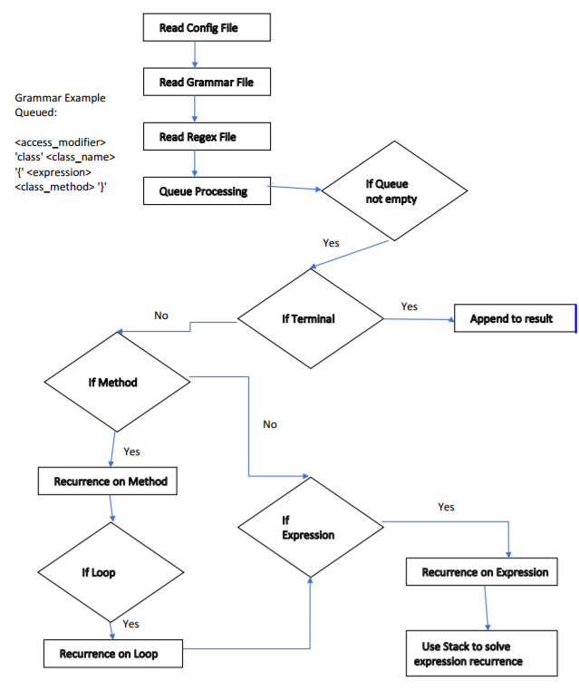

# Course project Random Java Program Generator


### Overview
The project creates a syntactically correct but semantically meaningless Java application. The input to our main program
is a configuration file that defines various parameters that constrain the generation of a Java application (e.g., the 
number of lines of code and the number of classes).
Once the constrains are identified the program parses a grammar file that is the crux of random code generation.

We have used a BNF grammar format for the grammar file as shown below;
 
```
<expression>:=<access_type> <var> = <exp> <op> <exp>
<op>:=+ | - | *
<exp>:=<exp> <op> <exp> | <digit>
<class_name>:=<access_modifier> 'class' <class_name> '{' <expression> <class_method> '}'
<inheritence>:=<access_modifier> 'class' <class_name> 'implements' <previous_interface_name> '{' <interface_methods> <class_method> '}'
<class_method>:=<access_modifier> 'void' <method_name> '(' ')' '{' <for_loop> <expression> '}'
```

The program parses the grammar file: "src/resources/grammar.txt" and defines two levels;
1. Top-Level: These rules refer to various class and interface declarations
2. Low-Level: These refer to various programming constructs such as methods, loops, expressions etc.

Each generated java file contains atleast one element from high-level and multiple elements from the low-level, for which 
the bounds are specified in the configuration file.

The configuration file (src/main/resources/config.xml) serves the purpose of defining the bounds for various high and low level elements.

The flow of our application is as below;

 

## Setup and Running the project
1. Clone the project from `https://akshayv22@bitbucket.org/sylvestersavioraj/akshay_vedpathak_mohammed_noman_mulla_rohit_vibhu_channananjun.git`
2. Import the project in Intellij 
3. Run gradle and SBT build by running the following commands;
    - Gradle Build: Run command `gradle build` on Terminal in Intellij
    - SBT Build: Run command `compile` on the SBT Shell in Intellij 
4. Run the main class ProgramGenerator.java, post successful run the generated java files are created and added in the directory /generatedCode


## Implementation Details